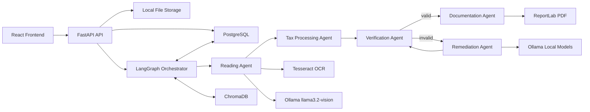

# System Architecture

## 1. Objective

Build a local-first, self-healing tax filing workflow that extracts tax data,
calculates results with deterministic rules, verifies every material output,
remediates detected issues, and produces a professional PDF filing report.

The system uses Ollama exclusively for model inference. Tax calculations and
validation remain rule-based and auditable.

## 2. High-Level Architecture



## 3. Workflow

The intended state transition is:

`Upload -> Parse -> Calculate -> Verify -> Remediate -> Verify -> PDF`

1. The API stores the uploaded document and creates a submission record.
2. The Reading Agent performs OCR and vision-assisted field extraction.
3. The Tax Processing Agent applies deterministic federal and state tax rules.
4. The Verification Agent checks source consistency, arithmetic, rules,
   hallucination risk, and confidence.
5. Invalid results enter a bounded remediation loop.
6. Valid results are passed to the Documentation Agent.
7. ReportLab generates the final report and filing receipt.

The remediation loop must have a configurable maximum attempt count. A
submission that cannot reach the required confidence is marked for manual
review rather than silently accepted.

## 4. Agent Responsibilities

### Reading Agent

- Accept PDF, PNG, JPG, JPEG, and scanned documents.
- Render PDF pages to images when needed.
- Run Tesseract OCR.
- Use `llama3.2-vision:latest` through Ollama for document understanding.
- Reconcile OCR text with model-extracted values.
- Return schema-validated structured JSON.
- Preserve source page, bounding region, raw text, and confidence provenance.

### Tax Processing Agent

- Consume validated taxpayer and income data.
- Load versioned tax rules for the selected tax year and jurisdiction.
- Perform calculations in `tax_calculator.py`.
- Use decimal-safe, rule-based arithmetic.
- Produce a complete calculation trace.
- Never delegate authoritative arithmetic to an LLM.

### Verification Agent

- Check required fields and cross-field consistency.
- Recalculate and compare all monetary results.
- Validate rules, thresholds, filing status, and tax year.
- Compare extracted fields with source evidence.
- Flag unsupported model-generated values as hallucinations.
- Produce per-field and overall confidence scores.

### Remediation Agent

- Classify the failure and identify its likely root cause.
- Select a bounded correction action.
- Re-run OCR or vision extraction for low-confidence fields.
- Correct parsing or normalization errors.
- Request deterministic recalculation for calculation errors.
- Append every change to an immutable audit trail.
- Return corrected state to the Verification Agent.

### Documentation Agent

- Assemble verified data, calculations, evidence, and audit history.
- Generate a professional PDF with ReportLab.
- Produce a filing receipt and reference number.
- Include uploaded document previews and generated form artifacts.
- Refuse finalization when verification has not passed.

## 5. Shared Workflow State

The LangGraph state is planned to contain:

```text
submission_id
workflow_status
uploaded_documents
document_pages
ocr_results
extracted_tax_data
calculation_result
verification_result
confidence_scores
remediation_attempts
correction_history
agent_decision_logs
generated_artifacts
errors
```

Each state mutation should record the responsible agent, timestamp, input
references, output summary, and reason.

## 6. Data Storage

### PostgreSQL

PostgreSQL is the system of record for:

- submissions
- taxpayer profiles
- uploaded document metadata
- extracted fields and provenance
- tax calculation runs
- verification checks
- remediation actions
- agent decision logs
- generated artifacts and receipts

### ChromaDB

ChromaDB stores embeddings for retrieval-oriented material:

- versioned tax rule explanations
- document chunks
- prior remediation patterns
- form instructions

ChromaDB is not authoritative for tax rates or calculation rules. Versioned,
reviewed rule files and deterministic code remain authoritative.

### File Storage

Development uses local storage under `storage/`. The storage service boundary
will allow later replacement with object storage without changing agent logic.

## 7. Confidence Model

Confidence is planned at both field and submission level.

Inputs include:

- Tesseract confidence
- vision extraction confidence
- OCR and vision agreement
- schema validity
- source evidence availability
- arithmetic validation
- tax rule validation
- cross-field consistency

Critical monetary fields must pass deterministic checks regardless of model
confidence. The acceptance threshold and critical-field rules will be
configuration-driven.

## 8. Self-Healing Policy

Remediation actions are selected by failure type:

| Failure type | Planned action |
| --- | --- |
| OCR quality | Re-render, preprocess, and rerun OCR |
| Field ambiguity | Re-query vision model with cropped evidence |
| Parsing error | Normalize and parse from preserved raw text |
| Missing required field | Re-extract targeted field or request review |
| Calculation mismatch | Recalculate from authoritative rule set |
| Rule mismatch | Reload matching tax-year/jurisdiction rule version |
| Unsupported value | Remove value and re-extract from source evidence |

The loop terminates on successful verification, maximum attempts, or a
non-remediable/manual-review condition.

## 9. API Boundaries

Planned endpoint groups:

- `/api/v1/submissions`
- `/api/v1/documents`
- `/api/v1/workflows`
- `/api/v1/reports`
- `/api/v1/health`

Long-running processing should execute outside the request lifecycle. The API
returns a submission identifier, and the frontend polls or subscribes to
workflow status.

## 10. Frontend Boundaries

The React application is planned around:

- document upload
- submission progress
- extracted data review
- tax calculation summary
- verification and confidence details
- remediation audit trail
- final report and receipt download

The UI must clearly distinguish verified values, corrected values, and values
requiring manual review.

## 11. PDF Report Contract

The Documentation Agent will generate these sections:

1. Cover Page
2. Taxpayer Information
3. Extracted Data Summary
4. Tax Calculation Report
5. Verification Report
6. Self-Healing Audit Trail
7. Filing Receipt
8. Agent Decision Logs
9. Appendix

The report is generated only from persisted, verified workflow state.

## 12. Security and Compliance Boundaries

- Keep model inference local through Ollama.
- Validate file type, size, and content before processing.
- Encrypt sensitive data at rest and in transit in production.
- Avoid logging full taxpayer identifiers or raw sensitive documents.
- Apply role-based access to submissions and generated reports.
- Make audit records append-only at the application level.
- Define retention and deletion policies before production use.
- Treat the system as filing assistance until integrated with authorized
  federal and state e-filing services.

## 13. Implementation Phases

1. Backend foundation and data contracts
2. Reading Agent
3. Rule-based Tax Processing Agent
4. Verification and confidence scoring
5. Remediation loop
6. LangGraph orchestration
7. React frontend
8. ReportLab documentation
9. Integration, security, and end-to-end tests
